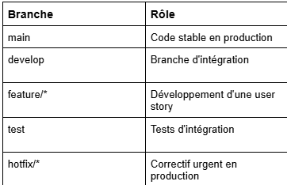

## Fonctionnalités

### client
- Catalogue de véhicules avec filtres (type, marque, prix max)
- Fiche détaillée par véhicule
- Soumission de dossier achat ou location avec pièces justificatives
- Dashboard personnel avec suivi des dossiers

### admin
- Dashboard avec statistiques globales
- Gestion du parc (ajout, suppression, changement de type)
- Traitement des dossiers (validation / refus avec commentaire)

---

## Technologies

- Backend : FastAPI + Python
- Base de données : MySQL 
- Templates : Jinja2 |
- Tests : pytest + httpx

## Installation

### Prérequis
- Python
- MySQL (ou Docker)

### 1. Cloner le projet

```bash
git clone https://github.com/Bleakey/m-motors.git
cd m-motors
```

### 2. Installer les dépendances

```bash
cd backend
pip install -r requirements.txt
```

### 3. Lancer le serveur

```bash
uvicorn app.main:app --reload
```

> Compte Admin au démarrage :

> Email `admin@m-motors.fr` · Mot de passe `Admin123!`

---

## Lancement avec Docker

```bash
docker-compose up --build
```

Démarre MySQL et l'application en un seul commande.

---

## Tests

cd backend
pytest -v

(34 tests  ·  auth / vehicles / dossiers / admin)

---

## Branches


